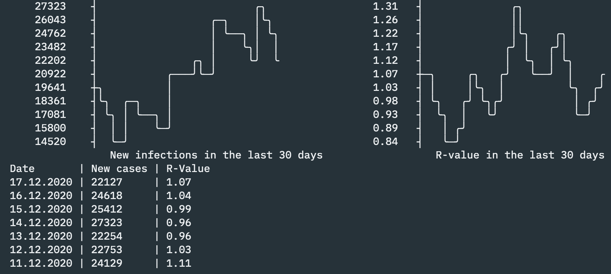

# RKI Plotter

This tool gets the COVID-19 cases based on the "Nowcasting" reported by
Robert Koch Institut (RKI) in Germany [1].

It plots the recent data via ASCII plots and tables.

[1] https://www.rki.de/DE/Content/InfAZ/N/Neuartiges_Coronavirus/Projekte_RKI/Nowcasting.html
